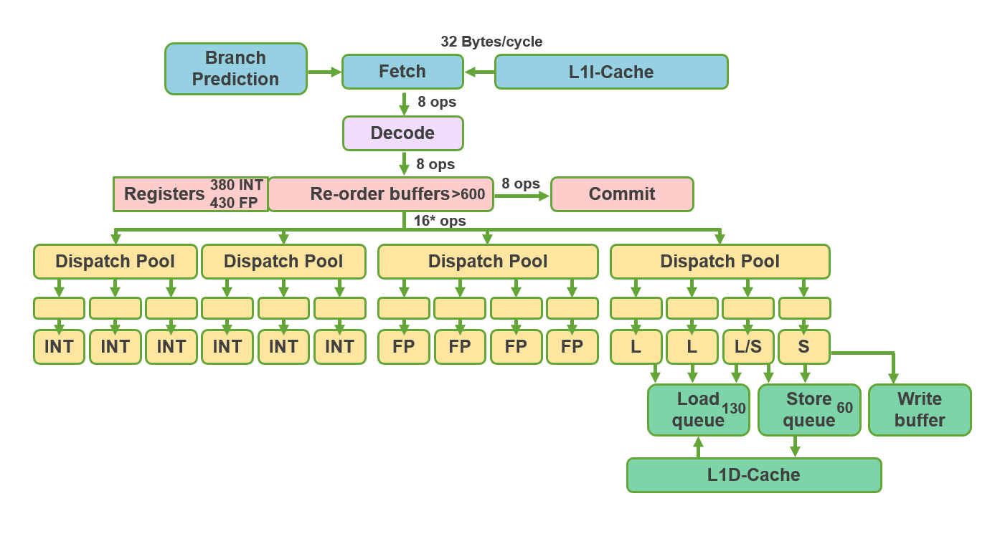
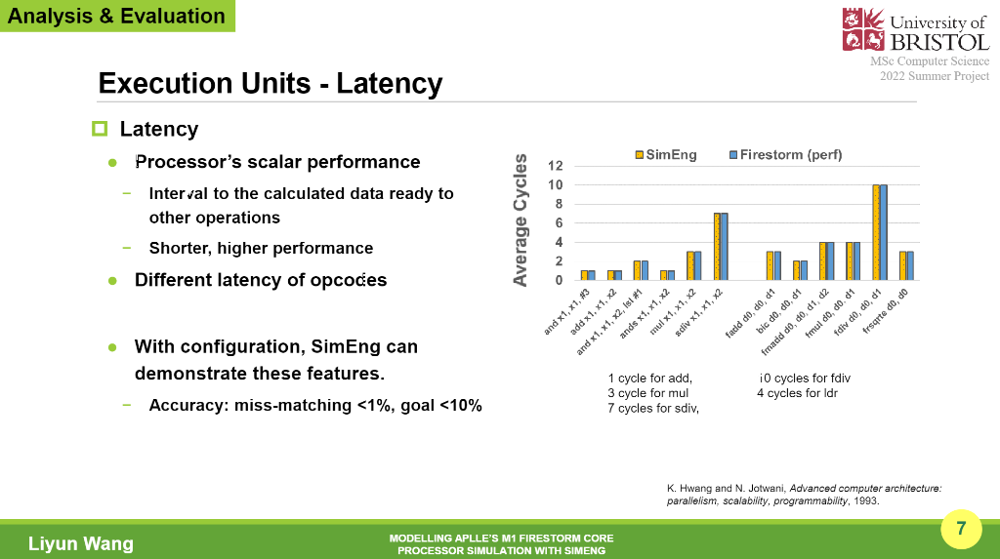

# SummerProject
2021-22 Summer Project in Computer Science

Apple M1 processor simulator with SimEng (a processor simulation framework)

**SimEng**: https://github.com/UoB-HPC/SimEng/tree/m1-dev

**M1 Config file**: [m1fs_v1p3](configs/m1fs_v1p3.yaml)

### Aims and Objectives 

Microarchitecture, which is an essential part of computing processors, has changed due to the
massive growth of computing devices. In 2020, Apple Inc. introduced its custom-made M1
System-on-chip (SoC), and the high-performance core, Firestorm, in Apple’s M1 has made
waves in the industry. To reveal the secrets of Firestorm core, processor simulation is the
key methodology. For modelling Firestorm, this project will investigate these key features of
Firestorm, such as the structure of its microarchitecture, and hardware-based technologies,
and explore to what extent my SimEng simulator could model the process in Firestorm’s
microarchitecture in an attempt to achieve accuracy within 10% of the real machine.

### Work 

**Microarchitecture for modelling Apple's M1 Firestorm**

This project will first look at the principles and techniques that have been commonly applied
in microarchitecture. Next, the configuration of SimEng simulator is introduced. These key
factors include the structure of execution units, the sizes of specific buffers, and the bandwidths
between stages. In addition, with the experiments for verifying the simulator, the perf tool,
which calculates the performance of the real hardware, and the SimEng simulator will execute
a supplied binary file compiled from a set of assembly codes. After that, the SimEng results
will be analyzed, and compared with the perf results, followed by an evaluation of the SimEng
simulator in terms of accuracy.

### Analysis and Evaluation

According to these results, the SimEng simulator can demonstrate the crucial characteristics
of fourteen execution units, which are unit counts, latency, and throughput, among different
groups of opcodes. The sizes of specific buffers used to record the processing instructions are
measured, and the figures are over 600 entries in ROB, 344 entries for the integer register file,
and 400 entries for the floating-point register file, which are probably smaller than the actual
sizes due to other usages in subsystems. The SimEng simulator is able to model the process in
which Firestorm performs the operations in parallel, and in a majority of cases, the accuracy
can achieve the goal, within 10% of the real hardware. However, a lack of loop prediction
impacts the accuracy of the SimEng simulator, and this problem also occurs in the case of
executing an actual program, generating Hailstone Sequences.

Overall, The SimEng simulator can model the process in which Firestorm executes in-
structions in parallel, and the overall accuracy of the SimEng simulator is within 25% of the
Firestorm core, impacted by the insufficient loop prediction. This problem could be resolved by
the implementation of a loop prediction buffer in future works.
